# Analysis Code
The code used for the analysis of kinematic data to investigate the effect of visual feedback distortions (VFD) on gait variability while walking on a treadmill.

## How to use
To run this code with your local R-Studio installation:
1. Within the R instance, navigate to `./runtime/`, and open the `index.Rmd` file.
2. Click `Run Document`. If it asks you to install any packages, click yes. You can find the list of packages used in `./runtime/source/source.R`.
> Initial calculation of the datasets may take some time (~5 minutes). After the first run, the results should be saved to tables in `results/` and startup should be significantly faster.
3. Browse the tabs and interact with the data

## Contents
- `index.Rmd` - The main Rmd code to run that loads all the source code, calculates or loads the results, and renders all the pages + sidebar. --> Run this code to start the interface.
    - The first block in this file (setup block) loads all the source code and calculates the heelstrikes and results. The first time this is done, it creates Rds files in the results folder, which will be loaded instead of calculated in subsequent runs. To recalculate the datasets, simply delete the old ones, and re-run this first block (or the whole file).
    - Then a series of pages are loaded. For an overview of each page, see below.

- `data/` - Contains all data of all participants.
- `pages/` - Contains the Rmd code for rendering the shiny pages + sidebar (shown below).
- `source/` - Contains the source code for the calculation of all the parameters etc. Note: also contains a `README.md`.
- `questionnaires/` - Contains information about the questionnaire questions (how to calculate the results, categories within the questionnaire, etc.).
- `results/` - Folder in which the resulting tables are stored (calculated gait parameters, target parameters, questionnaire results).

Pages

### General info
Click through the different tabs to get a preview and a brief explanation of what can be found there.

some general info:

- `sidebar_dynamicDataFiltering.Rmd`
The first "page" is the sidebar. This contains some settings that are shared across all pages. Most critical of this are the filtering settings, allowing you to filter out steps / trials / participants. There are also settings that change the figure sizes. (Sidebar is shown below in the screenshot of page1). Note that the filtered data is used for all plots and statistics calculations, and so changing these settings affects all the plots.

- Categories explanation:
    Some pages, or filters in the sidebar have selectors for categories (e.g., the histograms), which allow you to split the data for that visualization. These categories are:
    - **participant**: split data per participant
    - **trialNum**: split data by trial number (1=practice, 2, 3, 4=practice, 5, or 6)
    - **practice**: categorize data based on whether it's a practice trial (trials 1 and 4) or not (the rest) (TRUE or FALSE)
    - **startedWithNoise**: separate data based on whether the participant started with VFD (noise) condition or not (TRUE or FALSE)
    - **conditionNumber**: categorize data by condition number (first or second)
    - **trialNumWithoutPractice**: split data by trial number, excluding practice trials (1, 2, 3, or 4)
    - **trialNumWithinCondition**: categorize data by trial number within each condition (1 or 2, or 0 for practise)
    - **noticed**: split data based on whether the participant noticed the VFD during the experiment (asked each participant after their experiment, and noted this in the data). (TRUE or FALSE)
- Some pages allow additional options:
    - Average data across conditions - take average of the two trials of each participant and each condition.
    - Calculate difference + means per participant - Calculate the difference from baseline to VFD condition, as well as mean of both conditions.

### `page1_feetTrajectories.Rmd`

Plot the trajectory of the feet, with the heelstrike positions overlaid.

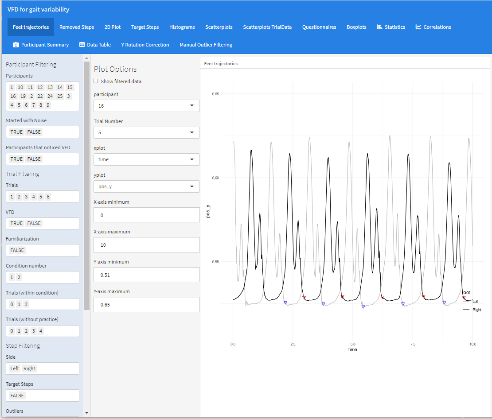

### `page2_removedSteps.Rmd`

Pie-chart to show which steps have been removed.

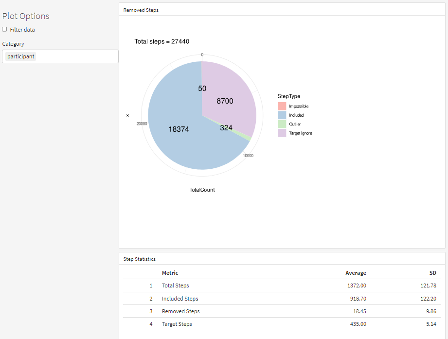

### `page3_rawTrackerData.Rmd`

2D plot of raw tracker data of all the different trackers.

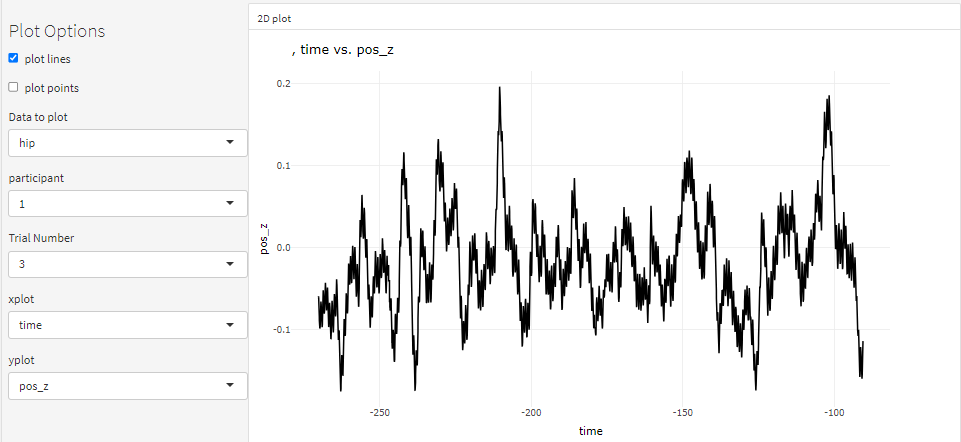

### `page4_targetSteps.Rmd`

Histograms of target step results.

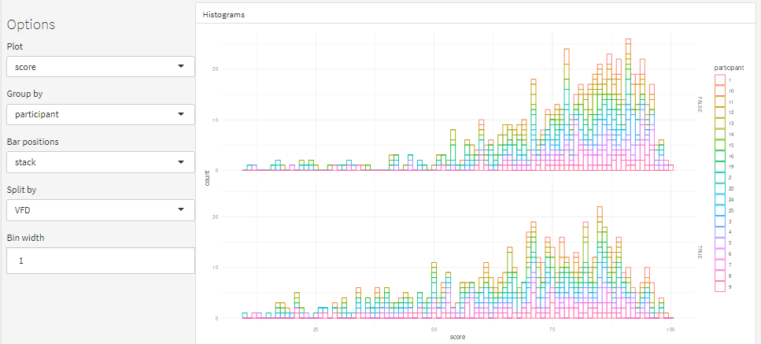

### `page5_histograms.Rmd`

Histograms of step parameters (heelstrike locations, stepwidth, step length etc).

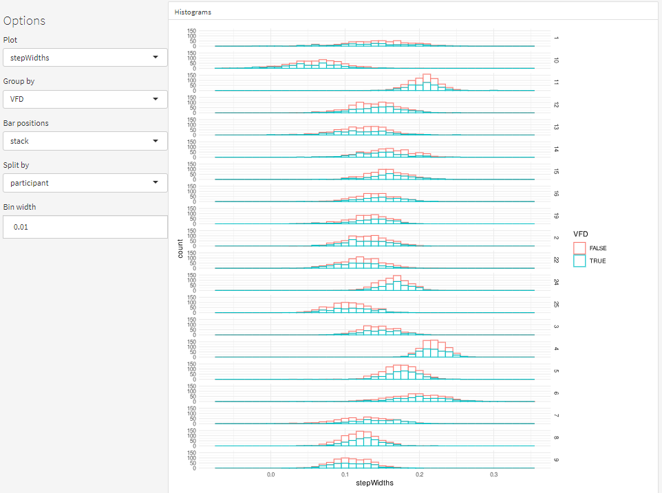

### `page6_scatterplots.Rmd`

Scatter plots to analyze relationships between step parameters.

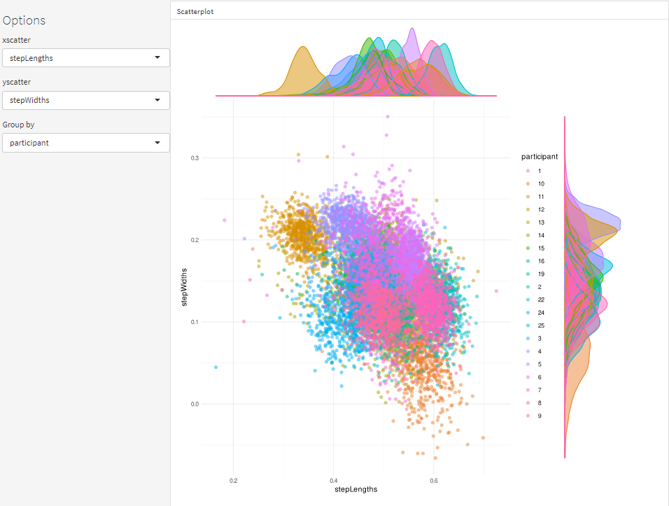

### `page7_trialScatterplots.Rmd`

Scatter plots by trial to analyze relationship between summarized results (mean, sd, cv) of step parameters, and/or questionnaire data.

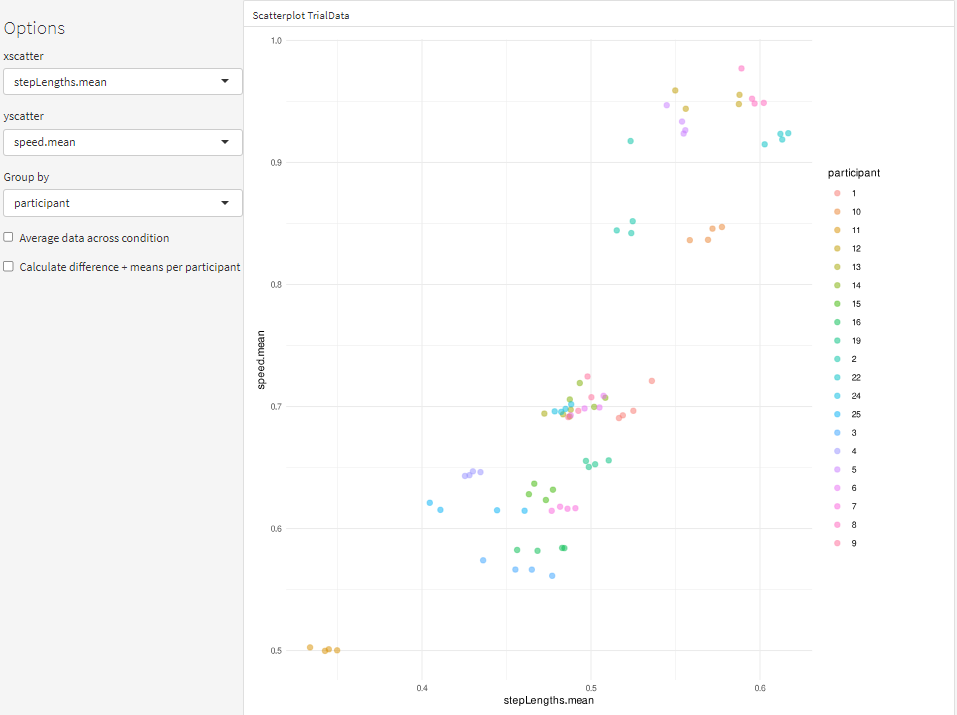

### `page8_questionnaires.Rmd`

Boxplots of questionnaire results (subcategories + total score).

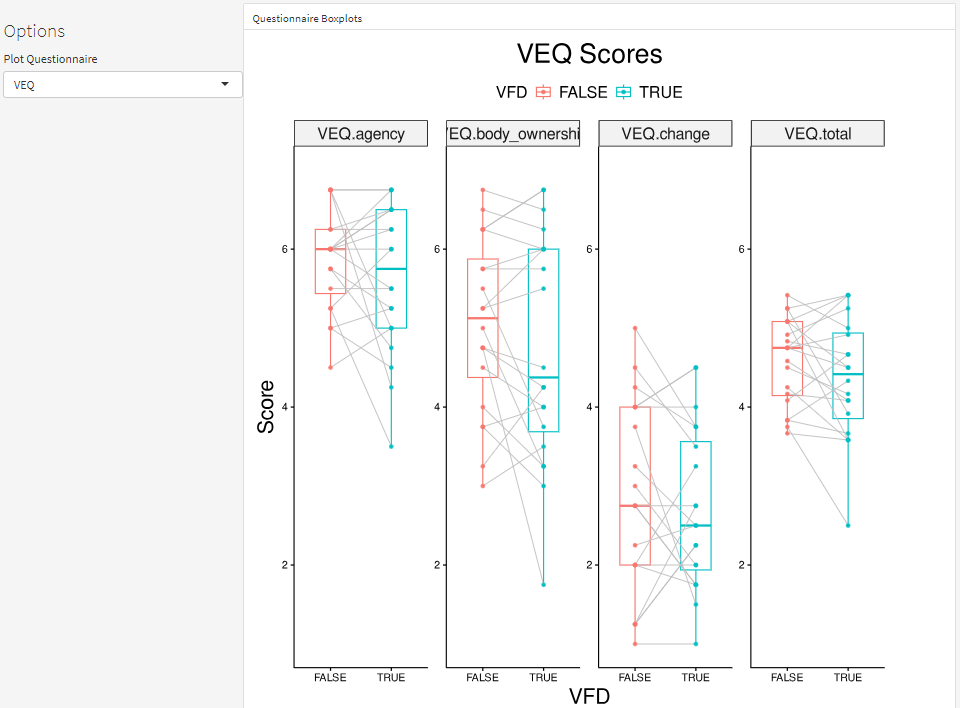

### `page9_boxplots.Rmd`

Box plots for step parameters.

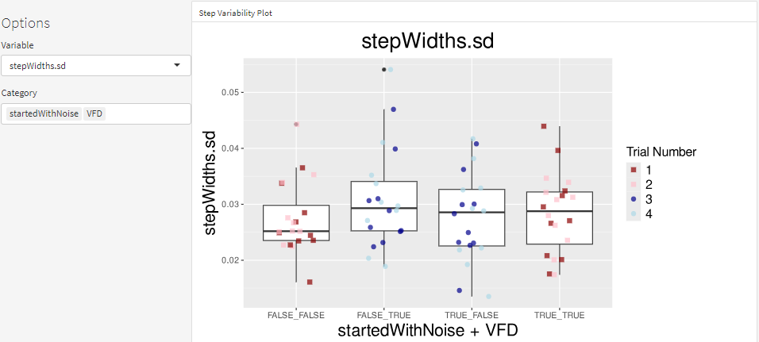

### `page10_statistics.Rmd`

Statistical analysis of step data, using LMM. Outputs tables with results, also does post-hoc if required. Scroll down to visually evaluate model assumptions (qq-plots etc).

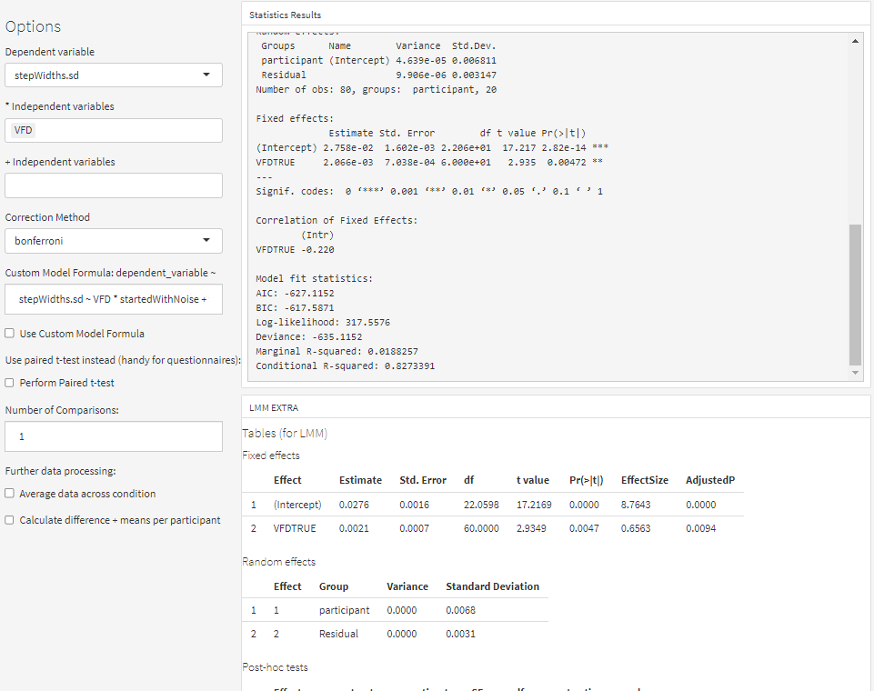

### `page11_correlations.Rmd`

Correlation plots showing relationships between different step parameters. Scroll down to evaluate test assumptions. If violated, you can set data to be non-parametric/bayes/robust types to do different (linear) correlation tests.

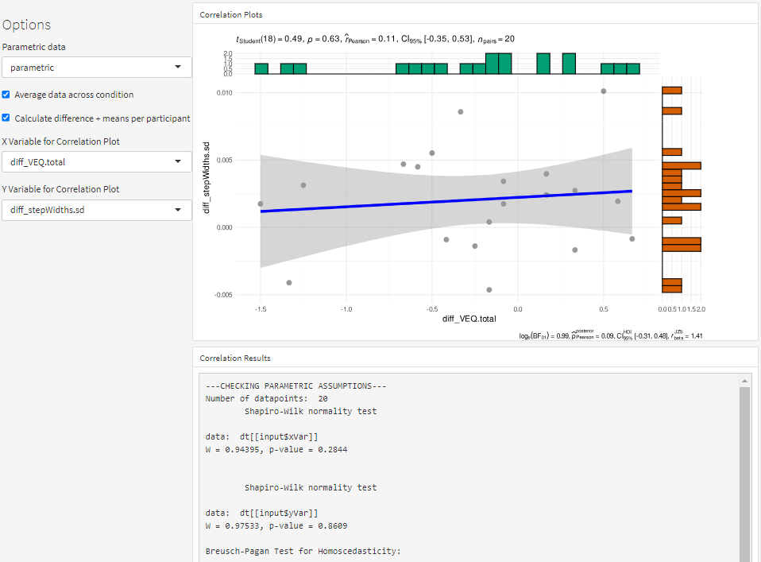

### `page12_participantSummary.Rmd`

Shows information about participant group (including demographics and category data). Also allows generation of pdf reports per participants which creates all plots of this interface for all trials of this particular participant, and allows you to download this pdf.

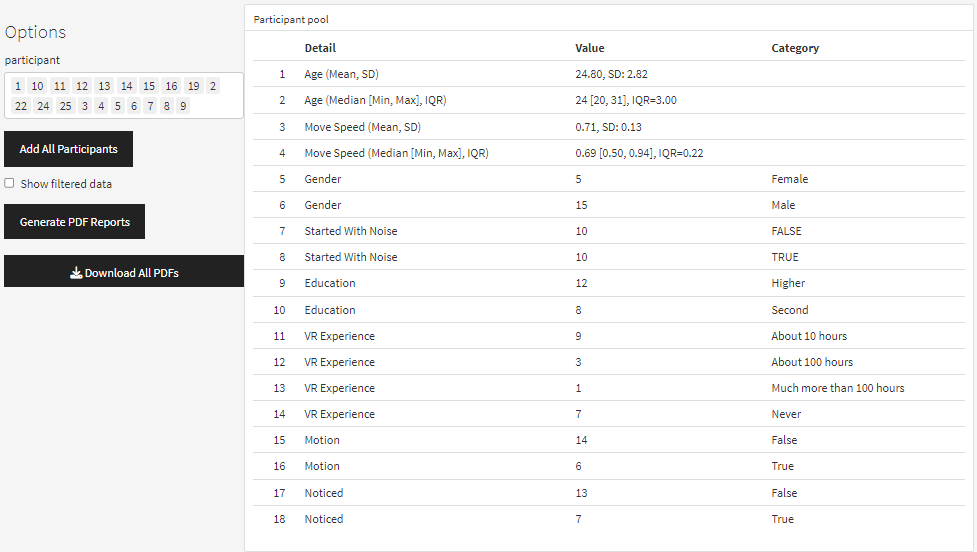

### `page13_table.Rmd`

Data table with all (filtered) step data. Enable summarize checkbox to see aggregated results per trial.

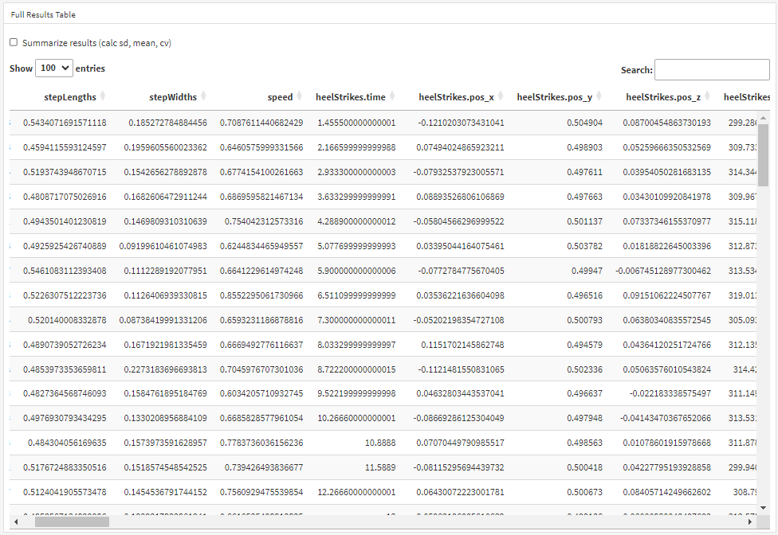

### `page14_dataCorrection.Rmd`

Functions to correct step data by rotation the whole data around the y axis (to correctly align the treadmill direction with data z axis). Save rotations into a table, shown next to the table.

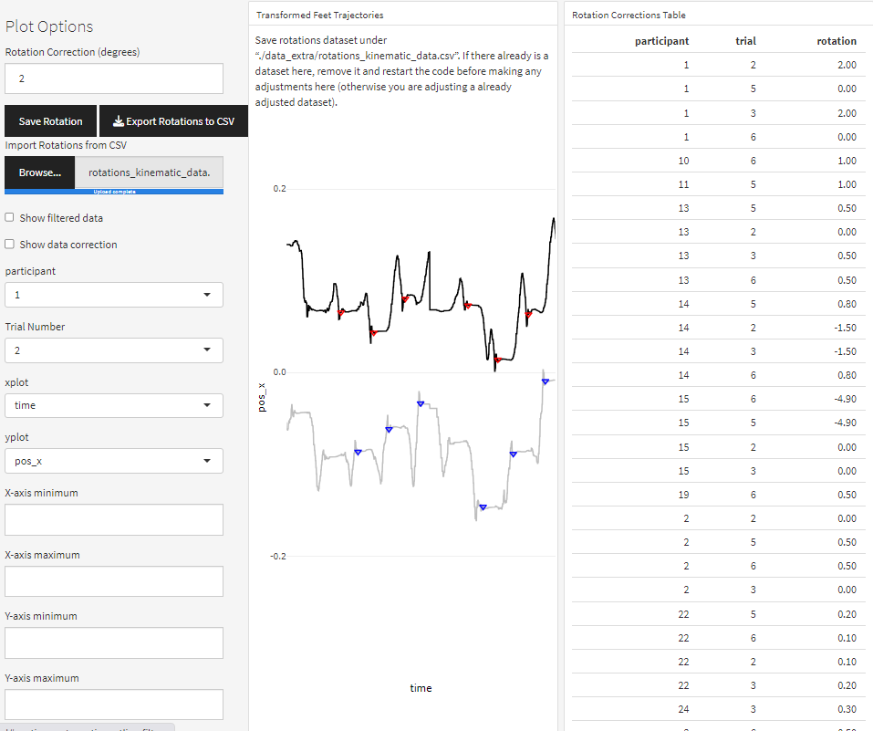

### `page15_dataFiltering.Rmd`

Tools for automatically filtering out unwanted data based on local outlier filtering (note: this was not used in the end and is kind of buggy).

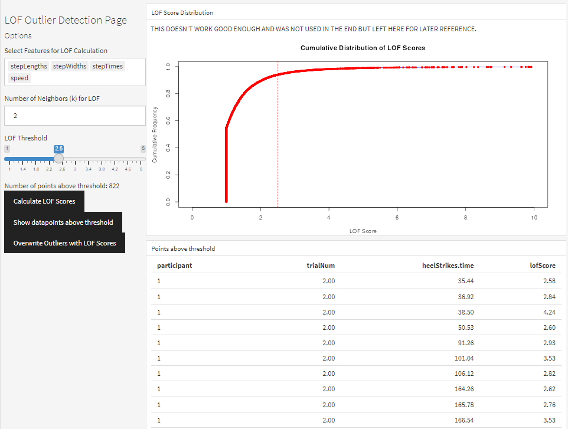

### `page16_manualOutlierFiltering.Rmd`

Interface to manually filter out outliers in the data. Save outliers to csv & import later to continue. Once finished, click overwrite outliers to mark the selected steps as outliers. Click Save to current RDS to re-save the gaitparams table to rds file with the current outliers flagged. Also has autosaving functionality (adviced to use, as software crashes randomly sometimes).

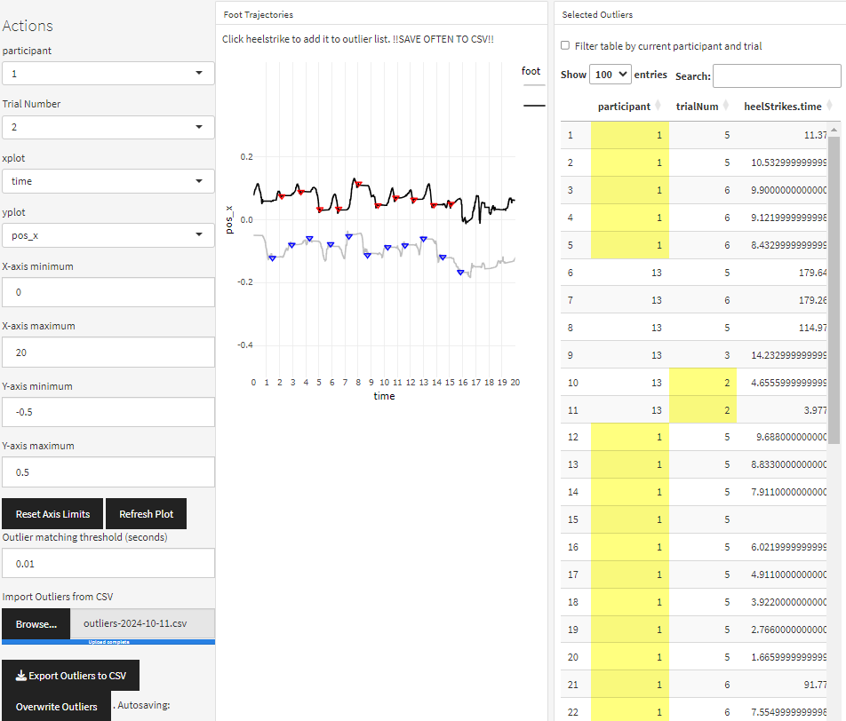

